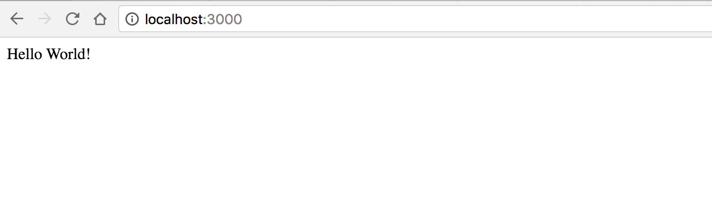

# Getting Started

## Requirements

To start up a local dev instance and to build your app, you will need the following software installed:

1. [Node.js 6.x LTS](https://nodejs.org/en/download/)
2. [MongoDB 3.x](https://www.mongodb.com/download-center?jmp=nav#community)
3. [Docker](https://www.docker.com/)
4. *Optional&mdash;* Recommend either using [Visual Studio Code](https://code.visualstudio.com) or [Atom](http://www.atom.io) (more on editors [here](editors.md)) 

## Installation

### 1. Clone the sample app repo.

```
$> git clone (repo-url)
```

### 2. Run npm install

Open a terminal in the folder you clone the repo to and run 

```
$> npm install
```

### 3. Build the Sample App

Either by using the built-in build script in Visual Studio Code (<kbd>&#8984;</kbd> <kbd>SHIFT</kbd> <kbd>B</kbd>) or Atom's TypeScript plugin OR by running the following in the terminal:

```
$> npm build
``` 

### 4. Start the Sample App

*NOTE: Make sure mongodb daemon is running and listening to connections on mongodb://localhost:27017 (default setting)*

```
$> npm start
```

### 5. Open Your Web Browser

Go to [http://localhost:3000](http://localhost:3000) and you should see the following:

